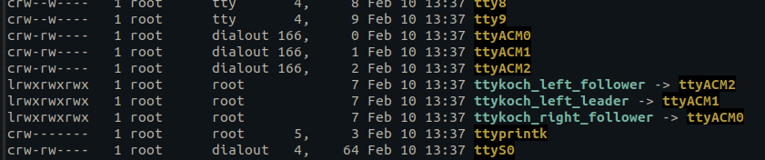

# <div align="center"> Udev Rules Guide </div>

## <div align="center"> Koch Robot Arm Symlinks </div>

<div align="center">

Create a symlink for USB devices by loading udev rules.  
This ensures the devices always appear with unique names as shown below.

  
</div>

---

##  <div align="center"> Steps </div>

### On your host machine

1. Plug in Koch Robot Arm 1 by 1.
2. Use `sudo dmesg | grep tty` to identify the device, and check its attributes.

  ```sh
  udevam info -a /dev/ttyACM0 | grep serial
  ```
3. Check each device's serial number & create udev rules.
  ```sh
  sudo nano /etc/udev/rules.d/99-koch-arm.rules`.
  ```

  sample:
  ```rules
  SUBSYSTEM=="tty" ATTRS{serial}=="5876043456", SYMLINK+="ttykoch_left_leader"
  SUBSYSTEM=="tty" ATTRS{serial}=="5876043359", SYMLINK+="ttykoch_right_leader"
  SUBSYSTEM=="tty" ATTRS{serial}=="5876043232", SYMLINK+="ttykoch_left_follower"
  SUBSYSTEM=="tty" ATTRS{serial}=="5876042900", SYMLINK+="ttykoch_right_follower"
  ```

4. Add the rules.
   
  ```rules
  sudo udevadm control --reload-rules
  sudo udevadm trigger
  ```

  Check if rules apply by `ls -l /dev | grep ttyACM`.